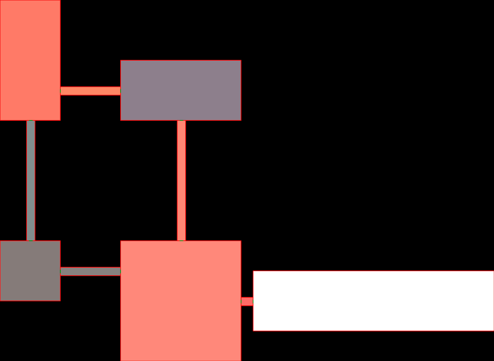

# LabyrinthGenerator

This repository contains the hand-in project for the university course Design Patterns.
The code must have at least 3 design patterns from the Gang of Four book.
The patterns here are:
- Visitor
- Iterator
- Builder
- Strategy

The program lets you create labyrinth by defining rooms and doors with a builder interface.
It also lets you render it in both bitmap and character format. See docs for samples.

